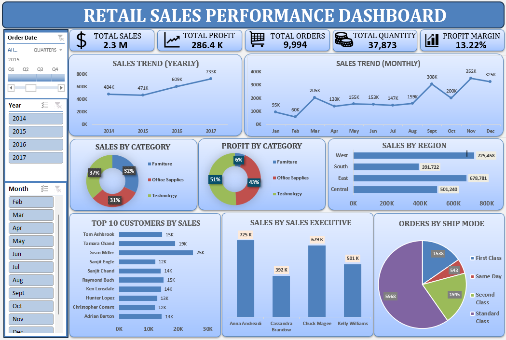
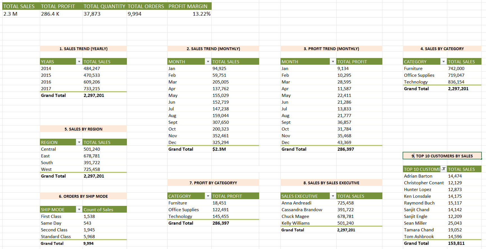

# 📊 Retail Sales Dashboard | Microsoft Excel

> An end-to-end Retail Sales Analysis project built in Microsoft Excel, covering data cleaning, data integration, feature engineering, pivot table analysis, and interactive dashboard creation.

---

## Project Overview

Developed an interactive Retail Sales Dashboard using the Sample Superstore dataset. The project involved cleaning and integrating data from multiple sheets, creating calculated fields, analyzing business performance with Pivot Tables, and designing a dynamic dashboard for decision-making.

---

## Tools & Skills

- Microsoft Excel
- Data Cleaning
- Data Integration
- Pivot Tables & Pivot Charts
- Dashboard Design
- Slicers & Timeline
- INDEX + MATCH
- MATCH
- IF
- ISNUMBER
- Business Reporting

---

## Dataset

The project uses the **Sample Superstore** dataset containing three separate sheets :

- Orders
- Returns
- People

These datasets were combined into a single master table for analysis.

---

##  Project Workflow
```text
Raw Data
   │
Data Cleaning
   │
Data Integration
   │
Feature Engineering
   │
Pivot Table Analysis
   │
Interactive Dashboard
   │
Business Insights
---

---

## Key Enhancements / Feature Engineering

Created additional analytical columns to improve reporting:

- Delivery Days
- Month & Year
- Quarter
- Profit Margin (%)
- Return Status
- Sales Executive

---

## Dashboard KPIs

- Total Sales
- Total Profit
- Total Orders
- Total Quantity Sold
- Profit Margin %

---

## Business Questions Answered

- Which year generated the highest sales?
- Which category is the most profitable?
- Which region performs the best?
- Who are the top customers?
- Which Sales Executive generated the highest sales?
- Which Ship Mode is used the most?

---

# Key Business Insights

The dashboard enables users to identify:

- Year-over-year sales trends
- Top-performing product categories
- Most profitable categories
- Regional sales performance
- High-value customers
- Sales Executive performance
- Overall business profitability

---

## Project Screenshots

### Dashboard


### Pivot Tables



---

## FUTURE IMPROVEMENTS

- Rebuild the dashboard in Power BI
- Perform SQL analysis on the same dataset
- Build advanced business KPIs and predictive sales analyis

---

Thank you for exploring this project. Feedback and suggestions are always welcome.
